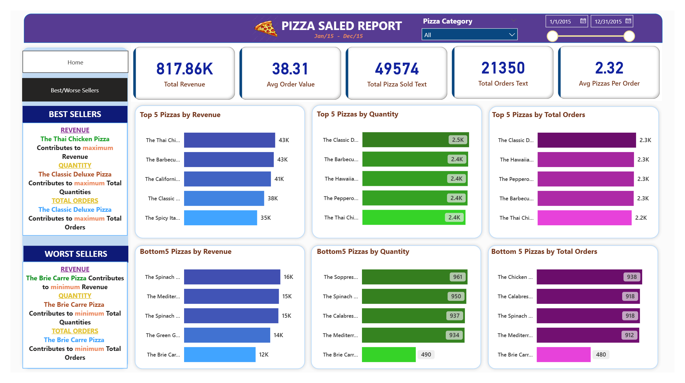

# Pizza Sales Dashboard - Power BI & SQL Project
## Project Overview
This project analyzes pizza sales data using Power BI and SQL to generate insights about total revenue, order trends, best-selling categories, and size performance. The dashboard is designed to support data-driven decision-making for sales and marketing optimization.
## Objective
- Analyze daily and monthly order trends.
- Calculate KPIs such as Total Revenue, Average Order Value, Total Orders, and Average Pizzas per Order.
- Analyze sales trends by time, category, and size.
- Identify sales trends and top/low-performing products.
## Tools
- SQL Server/MySQL
- Power BI
## Key Learnings
1. Connected and imported data from SQL Server into Power BI.
2. Building KPIs and calculated measures using DAX.
3. Designed interactive dashboard using charts, slicers, and filters.
## Dashboard Preview

